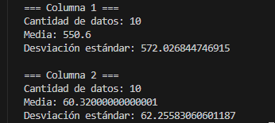

# 📊 Tarea 2 – Estadísticas con LinkedList propia

Este proyecto implementa un programa que **lee dos columnas de números desde archivos de texto**, los almacena en una **lista doblemente enlazada genérica** creada manualmente, y calcula su **media** y **desviación estándar muestral**.

---

## ⚙️ Funcionamiento

### 🗂️ Archivos de datos (`col1.txt` y `col2.txt`)
- Contienen listas de números (uno por línea).
- Están ubicados en `src/test/resources/`.
- Se procesan de forma automática al ejecutar el programa.

---

### 🔗 Lista doblemente enlazada (`DoublyLinkedList.java`)
Estructura de datos genérica implementada desde cero.

Cada nodo contiene:
- `prev` → referencia al anterior  
- `data` → valor almacenado  
- `next` → referencia al siguiente  

Permite almacenar y recorrer los datos cargados desde los archivos.  
Uso de **Generics `<E>`** para poder guardar cualquier tipo de dato (en este caso, `Double`).

---

### 📥 Lector de archivos (`DoubleFileReader.java`)
Se encarga de leer línea por línea cada archivo de números.  

Usa **Streams y Lambdas** de Java para:
- Limpiar espacios (`map(String::trim)`)
- Ignorar líneas vacías (`filter(...)`)
- Convertir cada línea en número (`map(Double::parseDouble)`)
- Agregar los valores a la `DoublyLinkedList<Double>`

---

### 📐 Estadísticas (`Statistics.java`)
Implementa los cálculos principales:
- **Media aritmética:** suma de todos los valores dividido entre `n`.  
- **Desviación estándar muestral:** raíz cuadrada de la varianza usando `n-1`.  

---

### 🚀 Programa principal (`Main.java`)

1. Lee los números de `col1.txt` y `col2.txt`.  
2. Guarda los datos en `DoublyLinkedList<Double>`.  
3. Llama a `Statistics` para calcular media y desviación.  
4. Imprime los resultados en consola.  

Ejemplo de salida:

